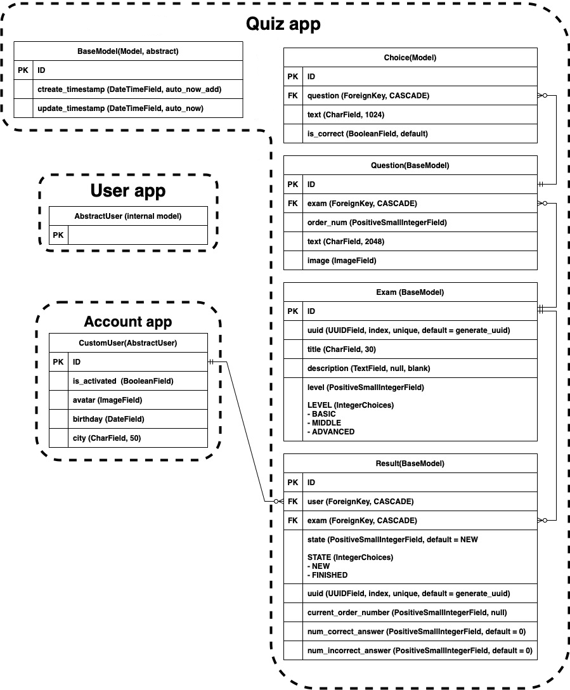

# QUIZ

## Технічні вимоги
### Веб-інтерфейс
  1. Реєстрація
      - [x] реєстрація (з підтвердженням по email)
      - [x] авторизація
      - [x] зміна пароля
      - [x] скидання пароля
    
  2. Можливості користувача
      - [x] проходження будь-якого тесту
      - [x] послідовне проходження запитань тесту (одне за одним)
      - [x] завершення відкладеного тесту
      - [x] видалення незавершеного тесту 
      - [x] перегляд результатів
    
  3. Після завершення тесту
      - [x] звіт про кількість правильних і неправильних відповідей
      - [x] відсоток правильних відповідей

### Сайт адміністратора
  1. [x] Керування користувачами
  2. [x] Керування тестами
      - [x] додавання тесту
      - [x] змінити тест
      - [x] видалення тесту
      - [x] валідація тесту
        - [x] неможливо зберегти запитання:
            - [x] без вказання правильної відповіді
            - [x] в яких всі відповіді правильні
        - [x] неможливо зберегти тест якщо:
            - [x] некоректний order_num (повинно бути від 1 до 100 і збільшуватися на 1)
            - [x] максимальне значення order_num не більше максимально допустимої кількості запитань
            - [x] кількість запитань менше 3 або більше 100

### Додаткові вимоги
1. [x] Проект повинен бути на Git
2. [x] Наявність файлу requirements.txt
3. [x] venv
4. [x] PostgreSQL
5. [x] Наявність дампу даних
6. [x] bootstrap
7. [x] Unit Tests
8. [x] Docker image
9. [x] Деплой на Amazon
10. [x] Планувальник
11. [x] Кешування

ext.: [ ] API + Tests

## DB - Schema

